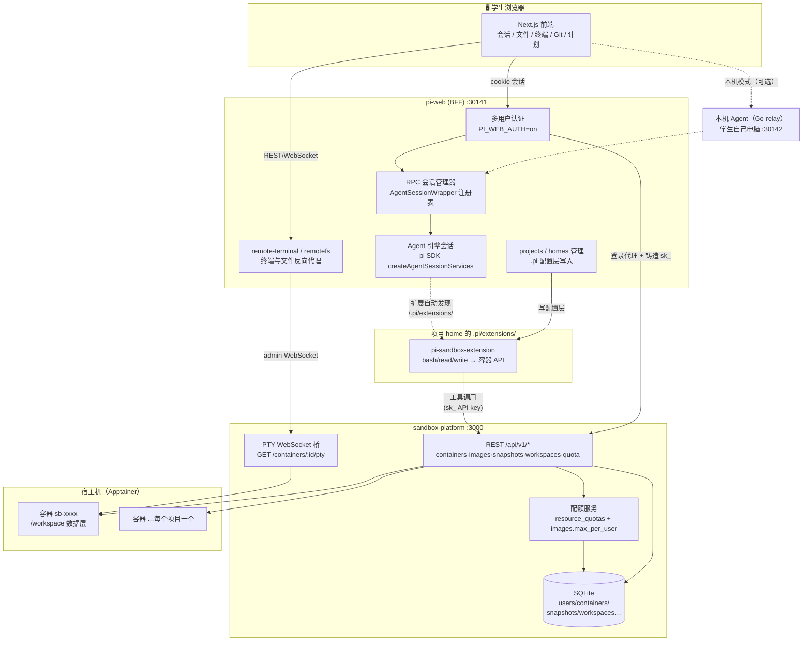
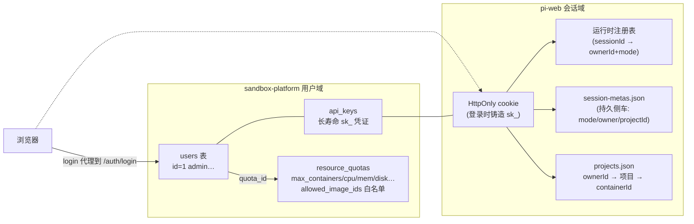
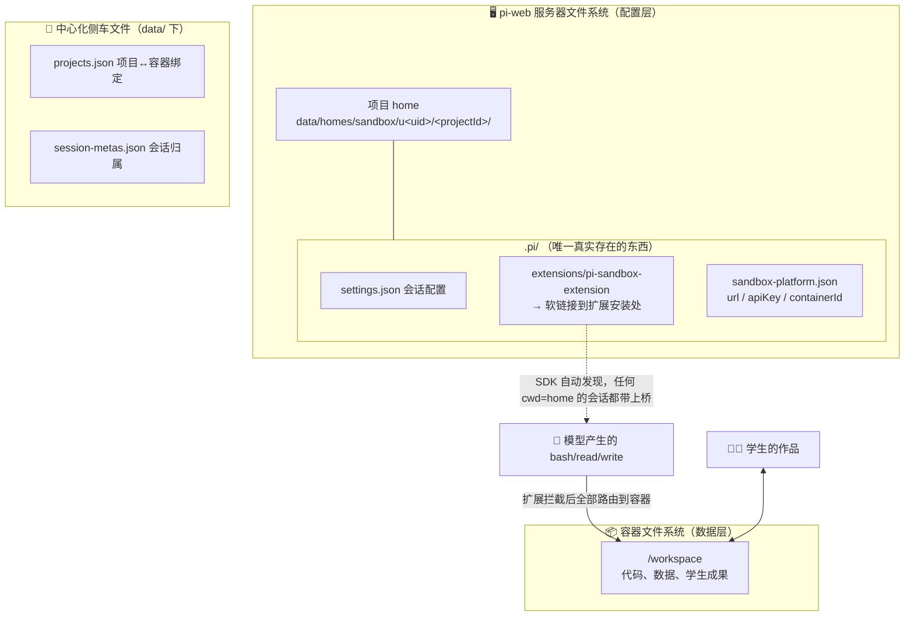
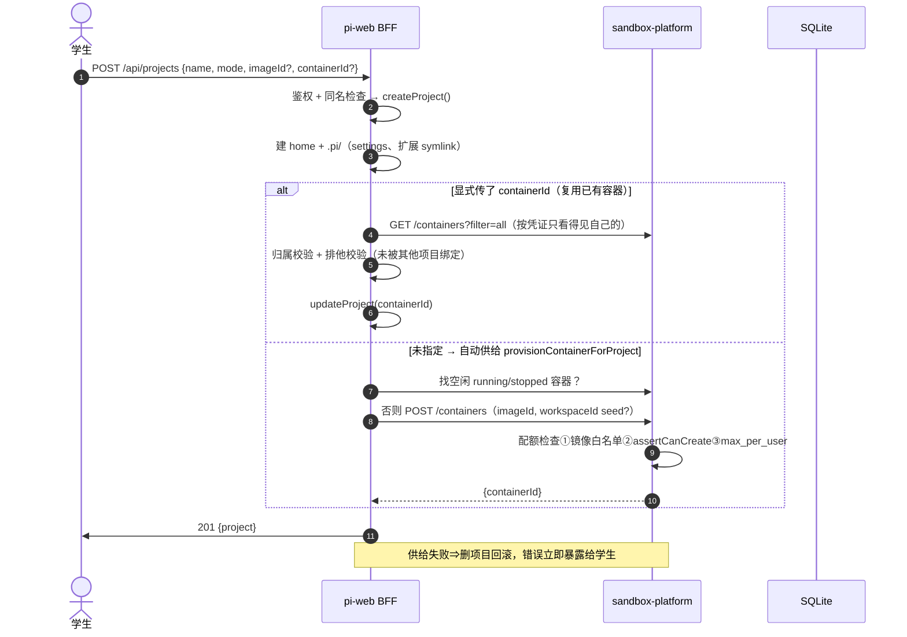
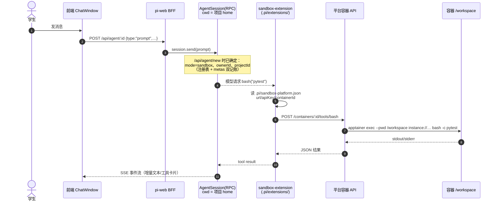
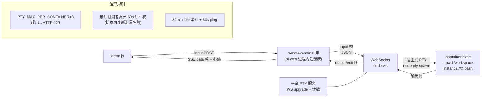
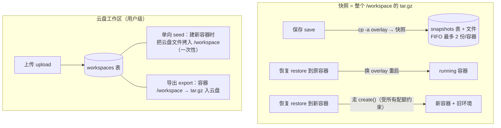
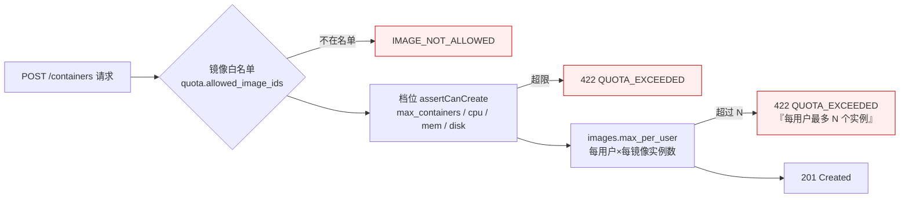
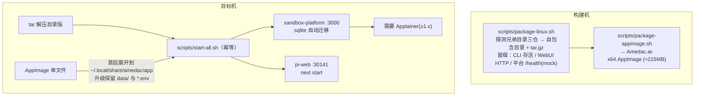

# 平台总体设计（架构 · 关系 · 管线 · 流程）

> 面向介绍/展示的单一入口文档。所有图为 Mermaid，可在 GitHub / Typora / VS Code 直接渲染。
> 配套运维文档：[DEPLOYMENT.md](./DEPLOYMENT.md)。

平台由三个仓库协作，构成一个多用户的"AI 编程实验教学"环境：学生在 Web 里建项目、开会话，
Agent 在**沙箱容器内**（或学生自己的电脑上）读写文件、执行命令；教师/管理员通过镜像、配额、
教学面板控制环境。

| 仓库 | 角色 | 技术栈 |
| --- | --- | --- |
| `pi-web` | WebUI + BFF（会话编排、项目管理、文件/终端代理） | Next.js 16, pi SDK 0.83 |
| `sandbox-platform` | 沙箱容器管理 API（容器生命周期/配额/快照/云盘/PTY） | Node 22（TS 类型剥离直跑）+ Express + SQLite |
| `pi-sandbox-extension` | pi 的工具桥接扩展（bash/read/write 路由进容器） | TypeScript（pi 扩展协议） |

---

## 1. 总体架构

要点：

- **浏览器只跟 pi-web 说话**。平台凭证（JWT/sk_ key）从不进入前端——经典的 BFF 边界。
- **沙盒扩展是"数据面"**：模型发出 bash/read/write 后，扩展直接拿项目凭证打容器 API；
  pi-web 是"控制面"（创建/绑定容器、开户、配额）。
- 三条互相独立的可信边界：WebUI 账号（= 平台账号的代理）、平台资源所有权、pi 会话归属。

## 2. 身份与多租户模型

- **登录即代理**：`POST /api/webauth/login` 把用户名密码转交平台 `/auth/login`，成功后为该用户
  铸造一枚长寿命 `sk_` API key 存入 WebUI 会话——之后所有 BFF→平台调用都用它。
- **会话三重账本**：运行时注册表（最权威，重启即空）＞ session-metas.json（进程间共享，mtime 失效重载）
  ＞ URL 参数。`resolveRemoteSession` 按 owner→meta 顺序解析模式与归属，拒绝跨用户访问。
- **两层权限检查**：任何 `remotefs/remoteterminal/remotetools` 请求都要过
  `requireUserIdentity`（谁）＋ `resolveRemoteSession`（这个会话是不是你的、什么模式、用哪个容器）。

## 3. 数据布局：两套文件系统

平台刻意区分「**配置层**」和「**数据层**」，这是理解一切 I/O 行为的钥匙：

设计含义：

| 事件 | 结果 |
| --- | --- |
| 新建沙盒项目 | 创建 home（含 `.pi/`），软链扩展，绑定容器 id 写入 `.pi/sandbox-platform.json` 与 projects.json |
| 新会话（cwd=home） | SDK 自动发现 `.pi/extensions/` ⇒ 无需注入即获得沙盒桥；**恢复/子智能体/分支会话同样生效** |
| 模型 `pwd` | `/workspace`（exec 带 `--pwd`，openPty 同样落在 /workspace） |
| 删容器但留快照 | 快照表带 user_id/image_id 冗余列，`ON DELETE SET NULL` —— 存档比实例活得久 |

## 4. 管线一：项目创建

复用已有容器（`containerId` 直传）是"环境复用"入口；配额中的 max_containers/max_per_user
只约束**新建**，不约束绑定既有容器（绑定时的排他性由项目层保证：一个容器只属于一个项目）。

## 5. 管线二：会话与工具执行（核心数据面）

强调三点：

1. **工具流量不过 BFF**——扩展持项目级凭证直连平台，pi-web 宕掉不影响已在跑的会话产物；
2. **会话注册以项目 mode 为准**（不是客户端随手传的字段），这杜绝了"刚建的沙盒会话被当成
   host 模式"整类事故；
3. 所有远端面板（remotefs 文件浏览、PlanPanel 计划读取、终端）都以
   `remoteSessionCtx = {sessionId,label}` 为单一事实来源决定走 `/api/files` 还是 `/api/remotefs`。

## 6. 管线三：交互式终端（PTY）

黑屏教训沉淀成的两条不变量：**必须真 PTY**（管道模式下 bash 无提示符无回显）；**泄漏的
PTY 占用的是全容器的并发名额**，所以订阅者清零后有 60 秒宽限强制回收。

## 7. 管线四：快照（游戏存档）与云盘工作区

两个方向都是**显式动作**而非持续同步——保证容器内部状态对学生可预期（不会出现"后台悄悄覆盖了
我的改动"）。游戏存档制（save/restore/delete，容量 FIFO）是快照的学生视角包装。

## 8. 配额体系

- `resource_quotas` 是**用户档位**（总量型：能开几个容器、多大规格）；`images.max_per_user`
  是**模板政策**（形状型：这种镜像每人最多几个实例）。两者正交，创建前依序检查。
- 这是后续「一键启动项目模板」的地基：

| 未来模板 | 组合方式 |
| --- | --- |
| DocQA（超小容器+MCP 子智能体问答，记忆存在实例里） | 该镜像 `max_per_user=1` + 小盘默认资源 |
| CodeHelper（可运行环境×3） | `max_per_user=3` + 中等资源 |
| TemplateDevBox（开发模板用，Host 模式） | 不进沙盒域，Host 会话天然不受容器配额影响 |

落地 administration：管理员 `PATCH /api/v1/admin/images/:id {"max_per_user":1}` 即刻生效；
pi-web 建项目对话框会在镜像名上显示"（每人限 N 个实例）"，超限时平台返回的中文错误直接透出。

## 9. 部署形态

## 10. 已知取舍与风险清单

| 取舍 | 原因 | 影响 |
| --- | --- | ---|
| 配置层/数据层分离，不做双向同步 | 可预期性优先 | 云盘↔容器仅显式 seed/export |
| Agent 工具流量直达平台（不经 BFF） | 解耦、pi-web 故障不影响已建会话 | 平台端要独立审计（有 sessions/audit 表） |
| AppImage 首启展开 ~1GB 到用户目录 | 只读挂载内的数据无法持久 | 磁盘紧张机器建议用 tar.gz 版 |
| 运行时注册表在重启后丢失 | 内存态性能最好 | 靠 metas 侧车补账（mtime 失效重载） |
| 一个容器绑一个项目 | 两项目共用会互相踩 /workspace | 需要"同环境多项目"时先复制项目再绑同一镜像新容器 |
